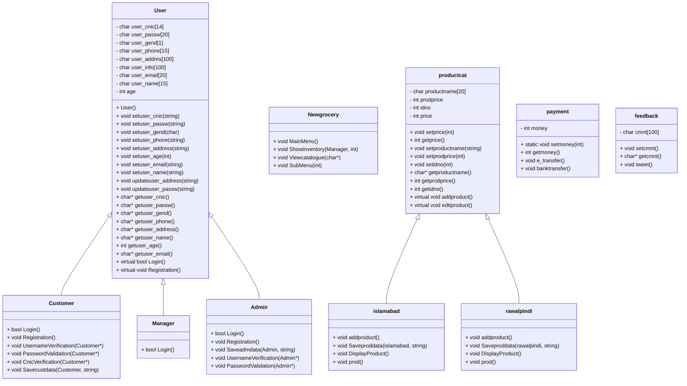

# New Age Grocery Store Management System

[](https://opensource.org/licenses/MIT)
[](https://github.com/nouman-x-ahmad/NEW-AGE-GROCERY-STORE/commits/main)


## Overview

Welcome to the **New Age Grocery Store Management System**! This C++ project provides a foundational object-oriented system for managing a grocery store, designed to handle customer, manager, and admin functionalities. It offers features for user registration, login, product catalog management, and basic payment and feedback handling, making it a comprehensive solution for small to medium-sized grocery operations.

This project is a testament to the power of object-oriented programming in creating practical and scalable applications. It demonstrates the use of C++ for building robust systems that can manage complex data and user interactions.

## Features

- **User Management:**
    - Comprehensive user role management including Customer, Manager, and Admin.
    - Secure user registration and login functionalities.
    - Rigorous username, password, and CNIC verification processes.
- **Product Catalog:**
    - Efficient product management for multiple store locations (Islamabad and Rawalpindi).
    - Features to add, search, and display products with ease.
    - Basic inventory management to keep track of stock.
- **Payment and Feedback:**
    - Flexible payment options including e-transfer and bank transfer.
    - Integrated feedback system to gather customer insights.
- **Object-Oriented Design:**
    - Leverages inheritance and polymorphism for efficient code reuse and scalability.
    - Modular design with well-organized header and source files for easy maintenance.
- **File Handling:**
    - Robust data persistence using binary files, ensuring data integrity and reliability.

## Getting Started

### Prerequisites

- C++ compiler (e.g., g++)
- Windows

### Compilation

1. Clone the repository:
   ```bash
   !git clone https://github.com/nouman-x-ahmad/NEW-AGE-GROCERY-STORE.git
   cd NEW-AGE-GROCERY-STORE
2. Compile the source files:
   ```bash
   g++ Source.cpp -o grocery
3. Run the Executable:
   ```bash
   ./grocery

### Project Structure:
```
NEW-AGE-GROCERY-STORE/
├── Header.h
├── Source.cpp
├── admin.h
├── catalog.h
├── customer.h
├── manager.h
├── payment_feedb.h
├── user.h
├── admin_sData
├── customer_sData
├── islamabad_sData
└── README.md
```

### File Descriptions
- **Header.h**: Contains class declarations and necessary includes, serving as the blueprint for the project's structure.
- **Source.cpp**: The heart of the application, containing the main implementation of the system functionalities.
- **admin.h, catalog.h, customer.h, manager.h, payment_feedb.h, user.h**: Header files for respective classes, each encapsulating specific functionalities.
- **admin_sData, customer_sData, islamabad_sData**: Binary files for data persistence, ensuring data is securely stored.
- **README.md**: This file, providing an overview and guide to the project.

## UML Diagrams:
### Class Diagram:


---
### Sequence Diagram: 


This sequence diagram illustrates the flow of interactions between different components of the system. It shows how the MainMenu interacts with Customer, Admin, and Manager for registration and login. Then, based on user roles, the SubMenu is invoked, which further interacts with Islamabad and Rawalpindi classes for product management, Payment for processing payments, and Feedback for collecting customer feedback.

This diagram provides a visual representation of the system's dynamic behavior, making it easier to understand how different parts of the application interact with each other.

---

## License:
*License
This project is licensed under the MIT License - see the LICENSE file for details.*
